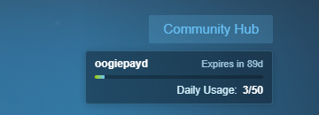
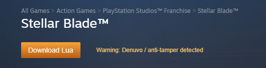
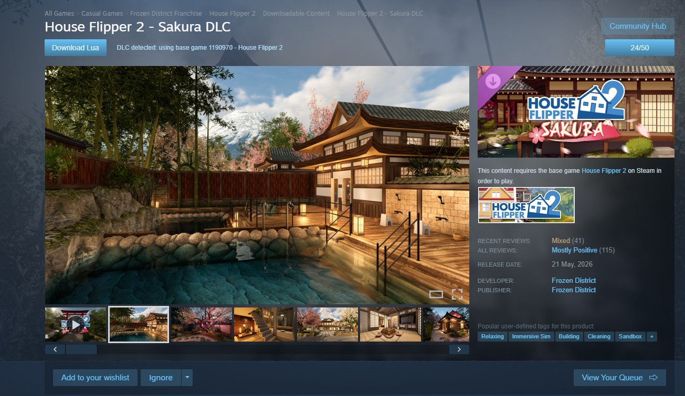

# Hubcap Plugin

Millennium plugin that works with the current version of HubcapTool. I made it for personal use, then decided to share it with the community.

Created by Oogiefied and GyomenRaza.

Special thanks to Hubcap Community!

## Preview

### Download Lua and Hubcap Usage Panel



### Remove Lua and Go to Library


### Denuvo / Anti-Tamper Warning



### DLC Base Game Detection



## Features

- Adds a `Download Lua` / `Remove Lua` button on Steam store game pages.
- Uses Hubcap's manifest API route to install both `.lua` and `.manifest` files.
- Checks Hubcap availability first and shows `Lua Unavailable` when no file exists.
- Shows `Checking...` with a small spinner while checking availability.
- Automatically detects DLC pages and uses the base game app ID.
- Shows the base game name when a DLC page is detected.
- Shows a warning when the Steam page mentions Denuvo or anti-tamper.
- Shows the `Download Lua` button in orange when Denuvo or anti-tamper is detected.
- Shows the `Remove Lua` button in red when Lua is already installed.
- Shows a `Go to Library` button after Lua is downloaded.
- Shows a Hubcap usage panel with username, API key expiry, daily usage count, progress bar, and loading spinner.
- Refreshes Hubcap usage on page load, after download, and when clicked manually.

## Requirements

- Steam
- Millennium
- HubcapTool
- Your own Hubcap API key configured in:

```text
%Steam%\config\hubcaptools\config.yaml
```

Required HubcapTool config keys:

```yaml
HubcapApiKey: your_hubcap_api_key
HubcapLuaDir: C:\path\for\lua\files
```

## API Key Safety

The plugin only reads your Hubcap API key locally from HubcapTool's `config.yaml` so it can call Hubcap.

It does not save, display, upload, log, or share your API key anywhere else.

The Hubcap usage check only shows your daily limit count, like `23/50`.

## How It Works

The plugin reads the Steam app ID from the current store page. If the page is DLC, it uses Steam appdetails to find the base game app ID first.

It uses Hubcap's official API through your locally configured HubcapTool API key, checks whether a Lua package is available, downloads the package when requested, and copies the returned files into the correct HubcapTool/Steam locations.

Temporary download/extract files are cleaned up after install.

## Install From Source

```powershell
npm.cmd install
npm.cmd run build
powershell.exe -NoProfile -ExecutionPolicy Bypass -File .\install.ps1
```

Then restart Steam or reload Millennium.

## Disclaimer

Hubcap Plugin is an independent community-made plugin and is not affiliated with, endorsed by, or officially connected to Millennium, Steam, Valve, or HubcapTool.

Millennium and HubcapTool are separate projects owned and maintained by their respective creators.
